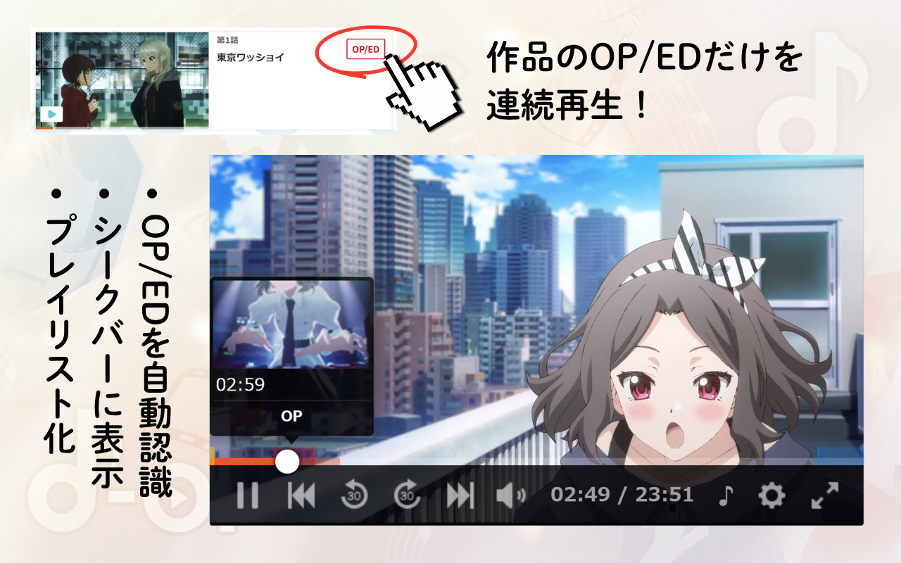
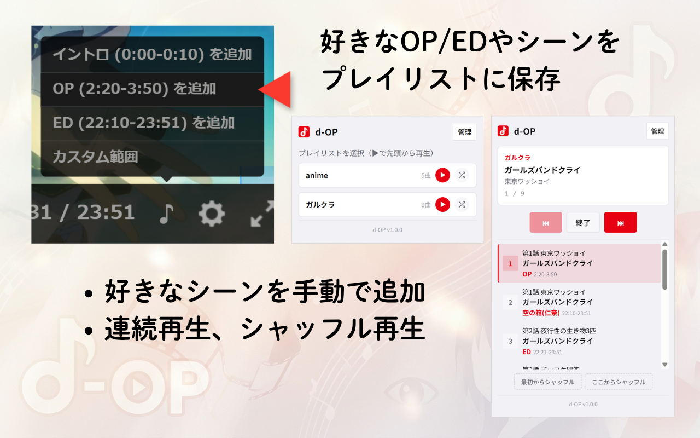
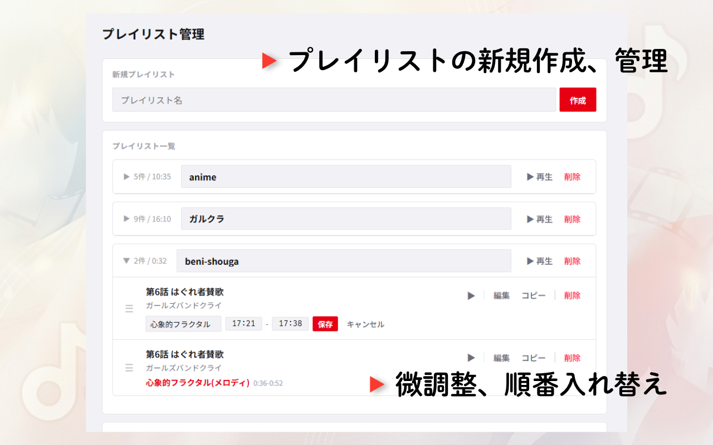

# [d-OP | dアニメストアでOPだけ再生する拡張機能](https://d-op.sasnews.dev/)


dアニメストアの動画から OP/ED のみを抽出して再生するブラウザ拡張機能です。
（Chrome / Firefox 対応）  
作品一覧からワンクリックで OP/ED 区間を選択し、プレイリストを作成して連続再生できます。

## 機能

- **OP/ED スキップ再生**: 作品一覧のエピソードに表示される「OP/ED」ボタンから、スキップ区間を選択して直接再生
- **プレイリスト**: OP/ED 区間をまとめてプレイリスト化し、連続再生・前後移動が可能
- **カスタム範囲**: 任意の開始〜終了地点を指定してプレイリストに追加
- **シークバーマーカー**: プレイヤーのシークバーに OP/ED 区間を可視化
- **インポート/エクスポート**: プレイリストを JSON で保存・共有
- **新規ウィンドウ再生**: dアニメ本来のプレイヤー挙動に合わせたポップアップ再生（設定でタブ切替可）
- **共有（任意機能）**: プレイリストを共有URLとして公開・取り込み。同意した場合のみ有効（公開 / 限定公開・検索・Remix 対応）

## 紹介画像

<p align="center">
  
  
  
</p>

## インストール

### ストアインストール（推奨）

[Chrome Web Store からインストール](https://chromewebstore.google.com/detail/d-op/mcjkaoagedekadnimbcbkhdkgpbnnodc)

[Firefox Add-ons からインストール](https://addons.mozilla.org/ja/firefox/addon/d-op/)

### 手動インストール（開発版）

#### Chrome

1. [Releases](https://github.com/sas-news/d-op/releases) から `d-op-*-chrome.zip` をダウンロード・解凍（v2 の ZIP はリリースワークフロー実行後に発行。またはソースから `bun run build` で `apps/extension/.output/chrome-mv3/` を生成）
2. Chrome で `chrome://extensions` を開く
3. 右上の「デベロッパーモード」を ON
4. 「パッケージ化されていない拡張機能を読み込む」→ 解凍したフォルダ（または `.output/chrome-mv3/`）を選択

#### Firefox

1. [Releases](https://github.com/sas-news/d-op/releases) から `d-op-*-firefox.zip` をダウンロード・解凍（v2 の ZIP は同上。または `bun run build` で `apps/extension/.output/firefox-mv3/` を生成）
2. Firefox で `about:debugging` を開く
3. 「この Firefox」→「一時的なアドオンを読み込む」→ 解凍したフォルダの `manifest.json`（または `.output/firefox-mv3/manifest.json`）を選択

> **Chrome と Firefox のマニフェスト違い**: Chrome MV3 は `background.service_worker` 必須、Firefox MV3 は `background.scripts` + `browser_specific_settings.gecko` が必要。このため WXT がブラウザ別に `chrome-mv3/` と `firefox-mv3/` を生成します。コード本体は共通です。

#### ソースからビルドする場合

```sh
bun install --frozen-lockfile
bun run build        # apps/extension/.output/ に chrome-mv3・firefox-mv3 と両 ZIP を生成
bun run verify:artifacts   # 生成物の同一性・権限・必須ファイルを検査
```

## 使い方

1. **dアニメストア** の作品ページを開く
2. 各エピソードに表示される **「OP/ED」** ボタンをクリック → スキップ区間を連続再生
3. プレイヤー画面で **「♪」** ボタン → 区間をプレイリストに追加
4. ツールバーの拡張機能アイコンをクリック → プレイリスト管理・再生
5. プレイリスト再生中はプレイヤー下部の **⏮ ⏭** ボタンで前後に移動

設定は拡張機能の **オプションページ**（ツールバーアイコン右クリック → オプション）から行えます。

### プレイリストの共有（任意）

1. オプションの「設定」にある **「共有機能」** 行で「有効にする」（初回のみ・いつでも無効化可）
2. プレイリストの **「共有」** ボタン → 公開範囲・説明・タグを入力して公開 → 共有URLが発行されます
3. 共有URLを知っている人はブラウザで内容を確認し、「d-OP で開く」で自分のリストに取り込めます
4. 公開リストは [d-op.sasnews.dev/explore](https://d-op.sasnews.dev/explore) からも探せます

※ 共有は完全に任意です。同意しない限り外部通信は一切発生しません。

## ファイル構成

v2 は WXT + TypeScript のモノレポ構成です。ブラウザに読み込ませる生成物は
`apps/extension/.output/chrome-mv3/` と `apps/extension/.output/firefox-mv3/` に出力されます。

| パス | 役割 |
| --------------------- | ----------------------------------------------------- |
| `apps/extension/wxt.config.ts` | ブラウザ別 MV3 マニフェスト生成（権限・gecko ID・アイコン） |
| `apps/extension/entrypoints/background.ts` | バックグラウンド（Chrome は Service Worker、Firefox はイベントページ）。ストレージ単一書き込み・ウィンドウ管理・Share API |
| `apps/extension/entrypoints/danime-*.ts` | dアニメ用コンテンツスクリプト（プレイヤー OP/ED 強制・作品一覧メニュー・メインワールドブリッジ） |
| `apps/extension/entrypoints/popup/` `options/` `import/` | ツールバーポップアップ・設定/プレイリスト管理・取り込み確認画面 |
| `apps/extension/src/` | アダプタ・プレイヤー・ストレージ・Share・UI ロジック（TypeScript） |
| `apps/web/` | 共有サイト（Astro + Cloudflare Workers/D1、`d-op.sasnews.dev`） |
| `packages/shared/` | 拡張機能と Web で共有する Zod スキーマ・ドメインロジック |
| `tests/e2e/` `tests/browser/` | Playwright E2E とネイティブブラウザ証跡ハーネス（[docs/testing.md](docs/testing.md)） |
| `docs/` | アーキテクチャ・共有API契約・テスト・リリース手順・要件トレース（[docs/traceability.md](docs/traceability.md)） |
| `STORE_LISTING.md` / `PRIVACY.md` | ストア掲載文面・権限正当化・審査手順（CWS/AMO）とプライバシーポリシー |

> 旧 v1（ルートの素 JS ランタイム）は task 25 で削除されました。履歴ソースは git タグ `v1.0.0`（ベースライン `fc9d7fd`）を参照してください。


## 共有機能（v2 で実装済み）

v2 では任意機能「共有（Share）」を追加しました。すべて同意ベースの明示操作のみで、
アカウント・自動同期・自動更新はありません（今後も追加しません）。

- **公開**: プレイリストをスナップショットとして共有URLで公開（公開 / 限定公開を選択）
- **取り込み**: 共有URLから他人のプレイリストを独立したコピーとして保存・再生
- **Explore**: [d-op.sasnews.dev/explore](https://d-op.sasnews.dev/explore) で公開リストの新着・人気・検索・タグ絞り込み
- **Remix**: 公開リストを取り込んで編集・再公開すると、出典関係が公開ページに表示されます
- **管理**: 公開版の更新・削除は拡張機能の管理画面からのみ（管理キーはエクスポートされません）

## ロードマップ

大きな機能追加の予定はありません。以下は方針として**実装しない**ものです：
アカウント機能、クラウド同期、自動バックアップ、動画・画像の収集、外部作品画像連携、
管理キーのエクスポート。不具合修正・dアニメ側の仕様変更追従は継続します。

## プライバシー

- すべてのデータはブラウザのローカルストレージ (`browser.storage.local` / `chrome.storage.local`) に保存されます
- 通常利用では外部サーバーへのデータ送信は一切行いません
- 任意の共有機能のみ、明示的な同意のうえで公開・取り込みの操作時に `d-op.sasnews.dev` と通信します
- dアニメストアのアカウント情報にアクセスすることはありません
- 詳細: [プライバシーポリシー](PRIVACY.md)

## お問い合わせ・関連リンク

- 公式サイト: [d-op.sasnews.dev](https://d-op.sasnews.dev/)
- 開発者: [sasnews.dev](https://sasnews.dev/)
- X (Twitter): [@sas_shinbun](https://x.com/sas_shinbun)
- お問い合わせ: [マシュマロ](https://marshmallow-qa.com/blp4p7r8sz8lt2a) / [GitHub Issues](https://github.com/sas-news/d-op/issues) / [contact@sasnews.dev](mailto:contact@sasnews.dev)


## 必要環境

サポート対象は **デスクトップ版 Chrome 現行安定版 + 1つ前のメジャー版**、
**Firefox 現行安定版 + ESR** です（Manifest V3）。動作確認済みの実バージョンは
[docs/testing.md](docs/testing.md) のブラウザマトリクスを参照してください。

- dアニメストアのアカウント（OP/ED 区間の再生に必要）

## ライセンス

MIT